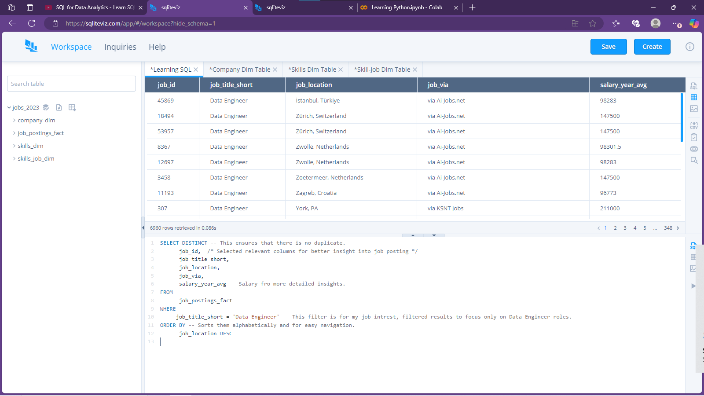

# SQL_Practice_Problems.
This repository showcases my SQL learning journey, including practice problems, solutions, and insights.

---

## 📌 Practice Problem 

**Question:**  
In the `job_postings_fact` table, retrieve the following columns:  
- `job_id`
- `job_title_short`
- `job_location`
- `job_via`
- `salary_year_avg`  

Filter to show only rows where `job_title_short` is **Data Engineer**.  
Order the results by `job_location` in descending order.

---

### 🔹 **Solution:**  
Since I worked in a virtual SQL environment, I don't have the raw SQL code, but below is a screenshot of my approach and the results.

**Result Screenshot:**  

---

### 🔹 **Analysis:**  
- The result shows job postings for **Data Engineer** roles across different countries.  
- There's a notable concentration in **Switzerland** and the **Netherlands**, suggesting strong demand in these regions.  
- Job sources like **AIJobs.net** seem popular for this role.

---

### 🚀 **Future Learning:**  
- Deepen the analysis by comparing with other job titles.  
- Explore average salaries by region for further insights.  
